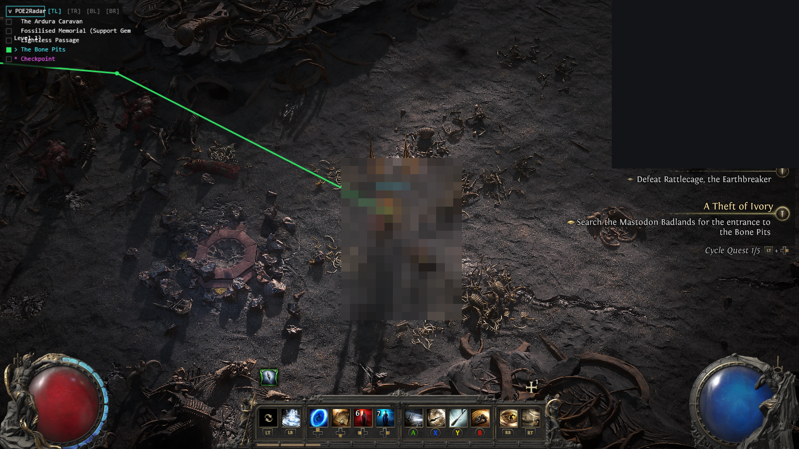

<div align="center">

# 🧭 POE2GPS

### Your turn-by-turn GPS for the wilds of Wraeclast.

*A strictly **read-only** navigation overlay for Path of Exile 2 — it shows you where to go, and never touches your game.*

[](https://github.com/luther-rotmg/POE2GPS/actions/workflows/ci.yml)
[](https://github.com/luther-rotmg/POE2GPS/releases)


[](https://discord.gg/32qdzWRja3)
[](#-full-controller-support--no-keyboard-needed)
[](https://ko-fi.com/lutherrotmg)
<br>




<sub>The green line is your route to the next objective. The legend names what matters — bosses, transitions, even a *Support Gem* memorial. You still drive.</sub>

</div>

---

## ✨ Why POE2GPS

You attach it, it reads the game's map out of memory, and it **draws a radar + a route line** to wherever you're headed. No more squinting at the minimap or alt-tabbing to a wiki — the path is on your screen. And because it's a focused, community-safe fork of [Sikaka/POE2Radar](https://github.com/Sikaka/POE2Radar), it deliberately strips everything that could get you flagged.

> ### ⭐ Enjoying POE2GPS? **Smash the Star button at the top of the page.**
> It's the single biggest way to help the project get found and keep getting built — one click, costs nothing, and genuinely means a lot. 🙏

## 🛡️ What it does — and never does

POE2GPS does three things **never** — and an automated compliance gate *fails the build* if any of them sneak back in:

| 🚫 Never | ✅ Instead |
|---|---|
| Sends input to the game (no `SendInput`, no auto-flask, no automation) | Just **draws** — you press every key yourself |
| Writes to / injects into the game (no `WriteProcessMemory`, no byte-patching) | Opens the game **read-only** (`PROCESS_VM_READ`) |
| Phones home (no poe.ninja pricing, no telemetry) | Everything is **local** |

> **Honest note on risk.** Reading another process's memory is a gray area — GGG has long been agnostic toward passive read-only overlays, but it's *tolerated, not blessed*. POE2GPS removes the categories GGG explicitly prohibits (input automation, process modification) to sit in the lowest-risk bucket. It's a personal/educational tool; you're responsible for how you use it. SmartScreen/AV may warn on an unsigned memory-reading exe — expected. **For the strongest setup, run PoE2 as a *limited Windows user* that's denied access to the POE2GPS folder — [step-by-step below](#-recommended-the-limited-user-setup).**

## 🔒 Recommended: the limited-user setup

The single best thing you can do for safety: run **PoE2 under a separate, limited (Standard) Windows user** that is **denied all access to the POE2GPS folder**. The game — and anything running inside it — then *literally cannot read your overlay's files or memory*, while POE2GPS (running as your normal admin account) can still read the game. Pure Windows account isolation; it touches nothing in the game.

> **Why it works:** a process can only read what its user account is allowed to. The game runs as a low-privilege account that's (a) blocked from the tool folder by an explicit Deny, and (b) too low-privilege to read your admin-level overlay's memory. Your overlay runs as *you* (admin), which can still read the game. A one-way mirror.

**One-time setup** — open **Command Prompt as Administrator**, then:

**1. Create a limited user for the game** (it's a Standard, non-admin user by default — choose any password, you'll use it to launch):
```bat
net user PoEPlayer * /add
```
The `*` makes it prompt for a password (typed hidden, twice). *GUI alternative: Settings → Accounts → Other users → Add account → "I don't have this person's sign-in info" → "Add a user without a Microsoft account".*

**2. Deny that user every permission on the POE2GPS folder** (use your real unzip path):
```bat
icacls "C:\Games\POE2GPS" /deny "PoEPlayer:(OI)(CI)F"
```
`(OI)(CI)` applies it to all files + subfolders, `F` is Full control, and `/deny` is an **explicit block that overrides any inherited "allow."** Verify it stuck: run `icacls "C:\Games\POE2GPS"` and look for a `(DENY)` line for `PoEPlayer`.

**3. Launch PoE2 as that limited user:**
- **Standalone client** — make a shortcut whose **Target** is (the full `runas.exe` path is the reliable form inside a shortcut):
  ```
  C:\Windows\System32\runas.exe /user:PoEPlayer /savecred "C:\Path\To\PathOfExile.exe"
  ```
  `/savecred` caches the password after the **first** launch so it won't ask again. Prefer to type it every time? Just drop `/savecred`.
- **Steam** — Steam runs only **one instance per PC**, so you must **fully exit your own Steam first** (right-click the tray icon → **Exit**), then start it as the limited user with a shortcut. Set the shortcut **Target** to the line matching your Steam drive:
  ```
  C:\Windows\System32\runas.exe /user:PoEPlayer /savecred "C:\Program Files (x86)\Steam\steam.exe"
  ```
  ```
  C:\Windows\System32\runas.exe /user:PoEPlayer /savecred "D:\Steam\steam.exe"
  ```
  The **first** run does two one-time things: Windows asks for `PoEPlayer`'s password (`/savecred` remembers it afterward), and **Steam makes you log in again** — it's a brand-new Steam profile under the limited user (your Steam password + Steam Guard; tick "remember me" so it sticks). After that it's **one click**: the shortcut opens Steam as `PoEPlayer`, and you launch PoE2 from there. *(Heads-up: only the POE2GPS folder gets the Deny — `PoEPlayer` still needs to read the Steam/game files, which it can by default. If Steam sits in `Program Files` and won't update as a standard user, install it to a plain folder like `D:\Steam`, or grant `PoEPlayer` **Modify** on the Steam folder. The standalone client avoids all of this.)*

**4. Run POE2GPS as your normal account** — `Overlay.exe` **as Administrator**, exactly as [Download](#-download-no-build-required) says. Admin reads the game fine; the game can't read back.

Pair this with POE2GPS's built-in stealth (random process name, hidden from screen capture) and you're in the lowest-risk bucket a read-only overlay can sit in. *(Summarized + syntax-verified from the community [Run PoE as Limited User](https://www.ownedcore.com/forums/mmo/path-of-exile/poe-bots-programs/676345-run-poe-limited-user.html) guide.)*

## 🎮 Full controller support — no keyboard needed

**Run the entire radar from your controller.** POE2GPS maps navigation onto the two stick-clicks that do **nothing** in PoE2 combat — so you steer the GPS without ever lifting your thumbs off the sticks:

| Button | What it does |
|---|---|
| **R3** *(click right stick)* | **next** target — step *down* the radar menu |
| **L3** *(click left stick)* | **previous** target — step *up* the menu |
| **hold R3 / L3** | **fast-cycle** — rip through the whole list |
| **L3 + R3** *(together)* | open / close the nav-menu list |

Pick your next objective, fast-cycle to the boss across the zone, pop the menu open — **all from the pad.** Built for **couch & handheld** play (Steam Deck, big-screen, lounge setups). And like everything here it's **100% read-only**: the controller is *read*, never driven — POE2GPS sends nothing to the game, ever.

## 🗺️ Features

- 🛰️ **Entity radar** — enemies, NPCs, chests, transitions, players, and POIs; optional world-space HP bars; dangerous rare/magic mods flagged.
- 🧱 **Terrain + map overlay** — the walkable-terrain mask and entity dots, projected onto the in-game map.
- 📍 **Tile landmarks** — boss arenas, transitions, reward rooms, surfaced the moment you enter a zone, with community-curated names.
- 🧭 **Navigation** — pick any landmark/POI/entity and get a smoothed A* route drawn to it (on the map, or as world waypoints). Multi-select, each its own color. **Cycle** the active target hands-free — keyboard (`Ctrl+Alt+]`/`[`) or **[fully from your controller](#-full-controller-support--no-keyboard-needed)** (R3/L3 to step, hold to fast-cycle). A saved **auto-nav** pattern list re-selects matching targets on zone entry. **Draw-only — never sends input to the game.**
- 🌌 **Atlas overlay + route planning** — labels nodes by content, off-screen arrows to tracked maps, shortest-hop auto-routes.
- 💎 **Dynasty-support maps** *(opt-in)* — highlight the endgame maps whose Anomaly bosses drop Lineage/Dynasty support gems (Sealed Vault, Sacred Reservoir, Derelict Mansion, The Jade Isles), each labeled with the gems it drops — full Citadel-style ring + arrow + track. Toggle in Settings; a dashboard reference card lists every map · boss · gems.
- 🏷️ **Loot & reward labels** *(opt-in)* — name labels over on-ground drops by category (Uniques, Currency, Runes, Soul Cores, Uncut Gems, Essences, and more), plus Ritual / Runeforge reward overlays. Names only — no economy values.
- 🏛️ **Monolith reward panel** *(off by default)* — a dedicated overlay panel listing nearby monolith rewards, color-graded by the best reward offered (configurable Exalted threshold), with a hide-collected toggle.
- 🧪 **Objective Director** *(experimental, off by default)* — auto-routes you through a zone's objectives in priority order: **seasonal event → side bosses → side zones → exit**. Still maturing — [roadmap below](#-roadmap).
- 🚩 **Campaign GPS** *(experimental, off by default)* — cross-zone campaign navigation: routes you to the next critical-path zone's exit from a built-in zone-order table, shown on the overlay and the Director's Zone Plan. A quest-memory precision layer is [in the works](#-roadmap).
- 🗺️ **Entity Atlas** — name every entity the radar doesn't recognize (your names show on the radar instantly), classify the notable ones from a rich label set, and **export/import shareable packs** — or **[Contribute](#-community-mapping)** your finds to the whole community in **one click**. Submitted names get folded into the built-in table each release — a community effort to map the whole game.
- ⭐ **God-Roll Detector** *(experimental, off by default)* — scores your inventory items 0–100 and stars the god rolls, with **meta-derived starter weights** distilled from the current ladder so it works the moment you switch it on. One-click stat-id chips to tune what you value, rarity-colored items, per-affix **tier (T#/N) + % of max roll** (so you see *how good* a roll is, not just *that* the stat matters), and a green→red **score heatmap grid**. Dashboard **Gear** tab; reads inventory only while enabled.
- 🎨 **Customizable icons & display rules** — per-rule shape/color/size, editable live; drop your own `*.svg` into `icons/`.
- 🔔 **Audio alerts** *(off by default)* — short, distinct tones for the moments that matter: a rare/unique monster comes into range, a unique item hits the ground, or you reach your active objective. Each event toggles independently from a card pinned to the top of Settings. **Output only — never sends input to the game.**
- 🎁 **Community presets** — share your whole radar *look* (display rules + icon/HP-bar/terrain styles) as a copy-paste **share-code** or a `.poe2preset` file; import one to instantly adopt someone else's setup. A backup of your current look is saved automatically before any import.
- ⏱️ **Session HUD** *(opt-in, off by default)* — a live run tracker: session + zone timers, zones visited, zones-per-hour pace, area name + level, and a death counter (with a per-zone count). Each metric toggles independently and anchors to any screen corner; **Ctrl+Alt+R** resets the counters.
- 🩺 **Patch-resilience & self-healing** — starts even if the game isn't running yet and self-connects once it launches, re-attaches after a game restart, and self-detects when a PoE2 patch shifts the offsets. A **health pill** in the dashboard masthead + a Settings **Status** panel show the live read-state, and a **Force re-scan** button re-detects the game after a patch without a restart. An optional startup **update check** (the only request the overlay makes beyond your own machine — off-switchable in Settings) flags new releases.
- 🕵️ **Stealth / low footprint** — relaunches under a random-named hardlink, randomized window class/title, neutral assembly name + binary metadata, character name never exposed, release binary string-scrubbed, and **hidden from screen capture** (screenshots / OBS / share-screen) by default — toggle off in Settings if you want to capture the overlay itself.
- 🖥️ **Web dashboard** (`http://localhost:7777`, or **F12**) — click any entity/landmark to navigate to it; tune radar/icons/atlas. Local-only, loopback-gated.

## 🚀 Download (no build required)

Grab the latest **`POE2GPS-vX.Y.Z-win-x64.zip`** from the [**Releases**](https://github.com/luther-rotmg/POE2GPS/releases) page, unzip, and run **`Overlay.exe` as Administrator** (memory reads require it) with PoE2 already running. Self-contained — no .NET install needed. *(It relaunches itself once under a random name — that's the process-randomization feature, not malware.)*

## ⌨️ Hotkeys

| Key | Action |
|---|---|
| **F12** | open the web dashboard |
| 🎮 **L3 + R3** / **Ctrl + Alt + M** | toggle the top-left nav-menu list |
| 🎮 **R3 / L3** *(or **Ctrl + Alt + ] / [**)* | cycle active nav target next / prev |
| 🎮 **hold R3 / L3** | **fast-cycle** through targets (auto-repeat) |
| **Ctrl + Alt + 1–9 / 0** | jump to nav target slot / clear |
| **Ctrl + Alt + R** | reset the Session HUD counters |
| **F6 / F7** | route to nearest landmark/POI / clear routes |
| **F10** | (Atlas open) inspect hovered tile, set route start/end |
| **F9** | quit (or right-click tray → Exit) |

*(All hotkeys are **read-only** and fire only while PoE2 is focused — keys are read, never sent to the game. No F8 — auto-flask was removed on purpose.)*

## 🔧 Build from source

Requires the **.NET 10 SDK**, Windows x64.

```bash
dotnet build POE2Radar.slnx
# then, with PoE2 running and you in a zone (as Administrator):
src\POE2Radar.Overlay\bin\Debug\net10.0-windows\Overlay.exe
```

## ✅ Compliance — how this stays safe

The three invariants above aren't just a promise — `scripts/compliance-gate.ps1` scans the shipped source and **fails the build** if any input-emission or process-write API (`SendInput`, `WriteProcessMemory`, `VirtualProtectEx`, `CreateRemoteThread`, …) appears, or if `OpenProcess` ever asks for write access. It runs in CI on every push/PR, and locally:

```bash
powershell -ExecutionPolicy Bypass -File scripts/compliance-gate.ps1
```

It also catches accidentally re-introducing removed code when merging upstream from Sikaka — see [docs/upstream-merge.md](docs/upstream-merge.md).

## 🤝 Community mapping

POE2GPS gets smarter the more players name the things the radar doesn't recognize yet — and you can pitch in with **one click**, no setup and no account.

When you label an entity or POI in the **Entity Atlas** tab (dashboard → **F12**), hit **Contribute** and your finds go straight to the shared community list:

- **What's sent:** only your **discovered names + labels** — a map of *game* entity paths (e.g. `Metadata/Monsters/…`) to the friendly names and categories you picked. **Never** your character, account, position, or anything identifying. It's **opt-in** — nothing leaves your machine until you click, and the first click asks you to confirm.
- **What happens next:** the project's collector **auto-filters junk** (spam, gibberish, oversized, or anything that looks identifying) and files the clean submissions as reviewable GitHub issues. A maintainer approves the good ones, and each release they're **folded into the built-in name table + label vocabulary** — so everyone's coverage ships to everyone. Over many releases, that's how we map the whole game.
- **How to help:** open the dashboard (**F12**) → **Entity Atlas** → give a few unnamed entities friendly names → **Contribute**. That's the whole loop. 💚
- 📖 **Full walkthrough:** the [**Labeling & Contributing guide**](docs/labeling-and-contributing.md) covers scan → label → contribute → what it unlocks, step by step.

💬 **Questions, bug reports, or ideas for what to map next?** Join the community on **[Discord](https://discord.gg/32qdzWRja3)**.

<sub>The collector is a small open-source Cloudflare Worker ([`cloudflare-worker/`](cloudflare-worker/)); the GitHub token lives only as a server-side Worker secret — **never** in the app. Forking POE2GPS? Point it at your own collector via the **Contribute URL** setting.</sub>

## 🏗️ Architecture

- **`src/POE2Radar.Core`** — read-only memory plumbing (`OpenProcess` read-only + `NtReadVirtualMemory`), the PoE2 offset table, the live read layer, the `Stealth/RandomName` generator, and the `Campaign/` objective catalog + director.
- **`src/POE2Radar.Overlay`** — the overlay `.exe` (`Overlay.exe`): attaches, AOB-resolves the game roots, runs the tick loop, renders the Direct2D overlay, plays the output-only audio cues, and serves the dashboard. Reads only.
- **`src/POE2Radar.Research`** — dev-time offset discovery tools. Never shipped; excluded from the gate.
- **`cloudflare-worker/`** — the optional open-source community-name collector (auto-filter → GitHub issue → merge pipeline). Server-side only; never part of the shipped overlay.

PoE2 offsets drift with patches — validated values live in `Game/Poe2Offsets.cs`; re-discover via the Research probes or pull updates from Sikaka.

## 🧪 Roadmap

The **Objective Director** is the headline work-in-progress. Zone-order **Campaign GPS** already ships (experimental). Next up: deep detection/cataloging of every relevant POI (seasonal events, passive-point upgrades, free skill/support gems), richer priority tiers, and a **quest-memory precision layer** — reading your actual quest-completion state to sharpen Campaign GPS beyond its built-in zone-order table.

## 💜 Support the dev

POE2GPS is **free and open-source, and always will be** — no paywalls, no "pro" tier, nothing locked behind a donation. But keeping the offsets patched every PoE2 update, shipping features, and answering issues is real time. If it's saved you some squinting at the minimap, a tip keeps the lights on. 🙏

[](https://ko-fi.com/lutherrotmg)

Totally optional — a ⭐ on the repo and sharing it with your party help just as much.

## 🙏 Credits

Forked from **[Sikaka/POE2Radar](https://github.com/Sikaka/POE2Radar)** (MIT); process-randomization adapted from **[NattKh/POE2Radar](https://github.com/NattKh/POE2Radar)** (MIT). Memory-layout research draws on **GameHelper2** (not redistributed; only re-validated offsets recorded). See [NOTICE](NOTICE).

### ⭐ Special thanks

Huge thanks to **torx** and **Kaonashi** for their reverse-engineering legwork, in-game testing, and tireless memory-capture work on the Expedition rumours research — going dump after dump to help crack the game's layout. This project runs on exactly that kind of community effort. 🙌

## 📜 License

MIT — see [LICENSE](LICENSE).
